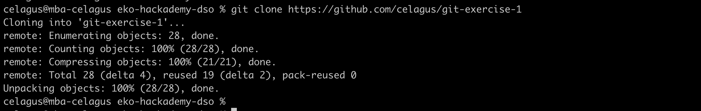
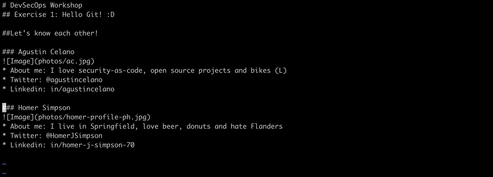
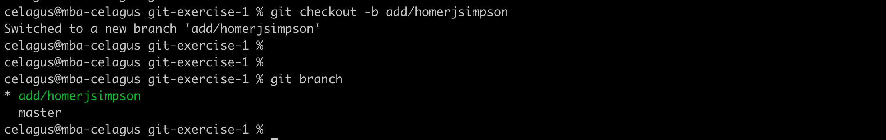
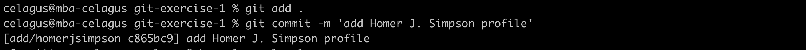
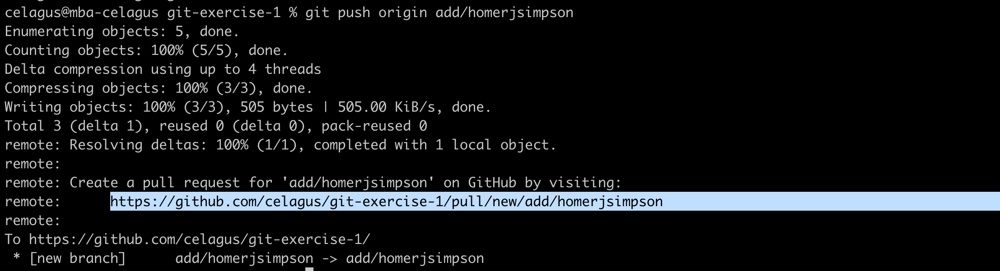
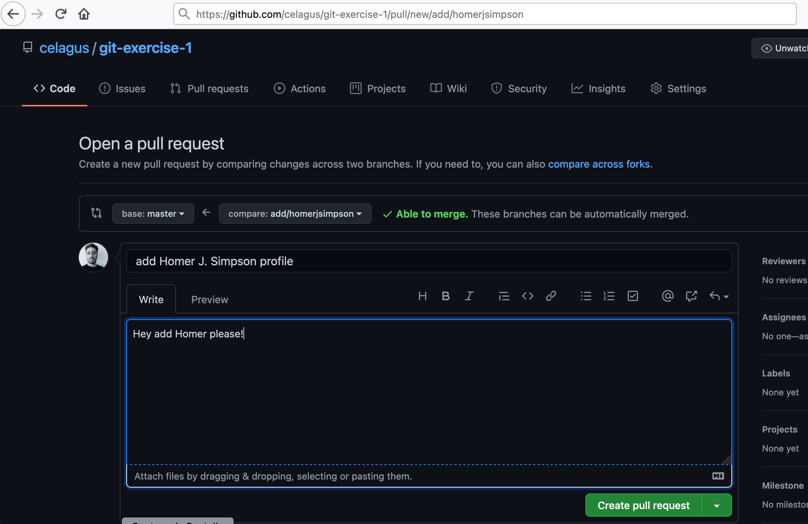
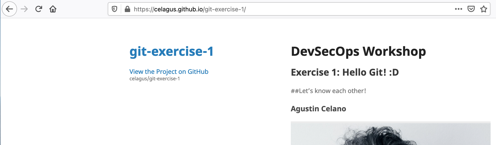

# Ejercicio 1: Git básico

## Intro
Bienvenidxs! Este es el primer ejercicio del módulo de DevSecOps de Ekoparty Hackademy. Este ejercicio les ayudará a poner en práctica conceptos básicos de Git, el VCS mas utilizado en la actualidad. Aprender a usar Git será importante para avanzar en el resto de los ejercicios, ya que se utiliza un enfoque GitOps para abordar la integración de seguridad en pipelines.

## Requisitos
* Instalar git en tu entorno local - [instructivo](https://git-scm.com/book/es/v2/Inicio---Sobre-el-Control-de-Versiones-Instalaci%C3%B3n-de-Git)
* Configurar tu identidad Git - [instructivo](https://git-scm.com/book/es/v2/Inicio---Sobre-el-Control-de-Versiones-Configurando-Git-por-primera-vez)
* Tener una cuenta en GitHub - [Sign Up](https://github.com/join)

## Objetivos de aprendizaje
1. Aprender a usar los comandos clone, branch, push, pull, add, commit, checkout
2. Colaborar en el repositorio Git de un tercero

## Manos a la obra!
1. Clona este repositorio de con el comando `git clone https://github.com/celagus/git-exercise-1`

2. Ingresa al repositorio (`cd git-exercise-1` o el comando equivalente en tu SO)
3. Ingresa al archivo "index.md" con el editor de texto de preferencia (en el ejemplo se usa Vi), luego agregar las líneas correspondientes a tu propia presentación personal. No olvides cargar tu propia foto (hasta 300x300 px), guardarla bajo la carpeta "photos/" y referenciarla en el index, tal como en los ejemplos. Guardar al finalizar.

4. Crea un nuevo branch utilizando el comando `git checkout -b add/nombre` reemplazando "nombre" por el tuyo propio. Para estar segurx de que estás en eñ branch apropiado utiliza el comando `git branch`.

5. Guarda los cambios con el comando `git add .` (el punto significa "todo lo que contiene este repo") para agregar los files al dominio de versionado y el comando `git commit -m 'tunombre'` para commitear los cambios (generar una nueva versión del "código")

6. Haz un push de la nueva branch y la nueva versión en el repositorio remoto con el comando `git push origin nombredelabranch`, donde debes reemplazar "nombredelabranch" con el nombre que le asignaste en el paso 4.

7. Crear un PR (pull request) para mergear en "main" los cambios de tu branch. Para esto debes entrar por navegador web a la URL quee te arrojó el paso anterior, como te muestro a continuación. Completa un mensaje y dale a "create pull request", le llegará al administrador del repo (yo 🤓) para ser aprobado.

8. Una vez aprobado el PR puedes chequear si apareces en la [webpage](https://celagus.github.io/git-exercise-1/) (hosteado GitHub Pages)

