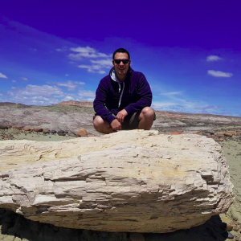

# DevSecOps Workshop
## Exercise 1: Hello Git! :D

##Let's know each other!

### Agustin Celano

* About me: I love security-as-code, open source projects and bikes (L)
* Twitter: @agustincelano
* Linkedin: in/agustincelano

### Homer Simpson

* About me: I live in Springfield, love beer, donuts and hate Flanders
* Twitter: @HomerJSimpson
* Linkedin: in/homer-j-simpson-70

### Alberto Mansilla

* About me: Full Stack Developer, Cybersecurity fan
* Twitter: -
* Linkedin: in/alberto-mansilla-0a80ab121/

### Facundo Alarcon

* About me: Cloud enthusiast. I enjoy solving problems, taking on new challenges, learning about cybersecurity and new technologies.>
* Twitter: @facualarcon_
* Linkedin: in/facundo-alarcón-27990711b

### Javier Herzkovich

* About me: Hola! estoy probando git
* Twitter: -
* Linkedin: in/javier-herzkovich-05898abb/

### David Rivas

* About me: WordPress Developer | DevSecOps Student
* Twitter: @deividlrivas
* Linkedin: in/davidlrivas/

### Matias Baghdassarian

* About me: :computer: Systems Engineering Student (UTN FRBA) | Online vendor | :mate: mate lover
* Twitter: @matibaghda
* Linkedin: in/matias-baghdassarian 
